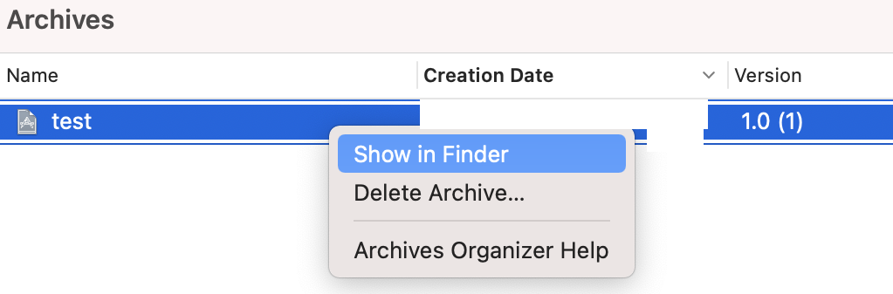

# 无需签名导出ipa

## 1. 修改 Xcode 设置使其允许无签名 archive

* 在 /Applications 中找到 Xcode
    

* 前往路径 Xcode.app - Contents/Developer/Platforms/iPhoneOS.platform/Developer/SDKs/iPhoneOS.sdk
    

* 修改两个文件，plist使用 Xcode 打开编辑，保存可能需要管理员权限
    
    

## 2. 无签名 Archive 工程

* 在 Build Settings 中搜索 sign
    * 修改 Code Sign Style, Manual
    * 修改 Code Sign Identity, 删除值文本
    * 新建 plist 文件，名称为 app.entitlements, 并设置 Code Sign Entitlements 为对应路径
    
* 设置顶部 Build Target 为 Any iOS Device, 点击菜单 Product - Archive
    

* 右键点击 Archive - Show In Finder, 右键, 显示包内容
    
    

* 前往路径 Products/Applications, 创建文件夹 Payload, 将 app 文件移入并压缩成 ipa 文件
**注意: 不可使用 OSX 自带的右键压缩**

    
    